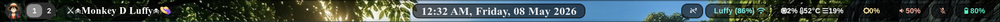

<div align="center">


# ⚓ Monkey D. Luffy Waybar

> *"I'm going to be King of the Pirates!"* — and King of the Desktop, apparently.

**A blazing-fast, anime-inspired Waybar configuration for Hyprland.**  
Minimal. Colorful. Hacker-flavored. Pirate-approved. 🏴‍☠️

<br/>

[](LICENSE)
[](https://hyprland.org)
[](https://archlinux.org)
[](https://github.com/Alexays/Waybar)

<br/>




</div>

---

## ✨ Features at a Glance

<div align="center">

| 🎨 Theming | ⚡ Performance | 🔧 Modules |
|:---:|:---:|:---:|
| 10 CSS themes included | Lightweight & fast | 12+ custom modules |
| Animated hover effects | Shell-script driven | Hyprland workspaces |
| Rounded corners & blur | Minimal dependencies | Custom battery script |

</div>

---

## 🗂️ Folder Structure

```
waybar/
├── 📄 config                  # Main Waybar configuration
├── 🖼️  icon/
│   └── monkey.png             # Luffy launcher icon
├── 📜 scripts/
│   ├── battery.sh             # Custom battery indicator
│   ├── luffy.sh               # Luffy-themed module script
│   └── system-monitor.sh      # CPU / RAM display
├── 🎨 style.css               # Active theme (default)
├── style1.css  →  style7.css  # Theme variants
└── style9.css  →  style10.css # More themes
```

---

## 📦 Layout Overview

### ◀ Left Section
- 🐒 **Monkey Launcher** — Opens Rofi on click with custom icon
- 🟣 **Hyprland Workspaces** — Numbered, animated, active highlighting
- ⚓ **Luffy Module** — Custom themed indicator

### ▶ Center Section
- 🕐 **Clock** — Day · Date · Time with 24h support

### ▶ Right Section
- 🔊 **Audio** — Speaker & Mic with scroll-to-adjust
- ☀️ **Brightness** — NVIDIA backlight, scroll or click
- 📶 **Network** — WiFi SSID + signal / Ethernet info
- 🔋 **Battery** — Custom icon script with percentage
- 💻 **System Monitor** — CPU & RAM in minimal text
- 💤 **Idle Inhibitor** — Toggle idle lock on/off
- 🗂️ **Tray** — System tray icons

---

## 🚀 Installation

### 1. Clone the Repository

```bash
git clone https://github.com/your-username/luffy-waybar.git
cd luffy-waybar
```

### 2. Copy Files to Config

```bash
cp -r waybar ~/.config/
```

### 3. Install Required Packages

```bash
# Core packages
sudo pacman -S waybar rofi pavucontrol pamixer brightnessctl playerctl jq

# Hyprland (if not installed)
sudo pacman -S hyprland

# Optional: fonts
sudo pacman -S noto-fonts noto-fonts-emoji ttf-font-awesome
```

### 4. Make Scripts Executable

```bash
chmod +x ~/.config/waybar/scripts/*.sh
```

### 5. Reload Waybar

```bash
killall waybar && waybar &
```

---

## 🎨 Switching Themes

This config ships with **10 CSS themes**. Swap them in one command:

```bash
# Example: switch to theme 7
cp ~/.config/waybar/style7.css ~/.config/waybar/style.css
killall waybar && waybar &
```

| File | Vibe |
|------|------|
| `style.css` | Default (active) |
| `style1.css` | Variant 1 |
| `style2.css` | Variant 2 |
| `style3.css` | Variant 3 |
| `style4.css` | Variant 4 |
| `style5.css` | Variant 5 |
| `style6.css` | Variant 6 |
| `style7.css` | Variant 7 |
| `style9.css` | Variant 9 |
| `style10.css` | Variant 10 |

---

## 🔤 Fonts

For icons and glyphs to render correctly, install:

- **[JetBrainsMono Nerd Font](https://www.nerdfonts.com/)** *(recommended)*
- **Font Awesome** — `ttf-font-awesome`
- **Noto Emoji** — `noto-fonts-emoji`

---

## 🛠️ Customization

Every detail is editable through the CSS files:

```
Colors · Borders · Transparency · Blur
Workspace styles · Hover animations
Module padding · Rounded corners
Icon styles · Font sizes
```

---

## 🗺️ Roadmap

- [ ] 🌦️ Weather module
- [ ] 🎵 Music player (now playing)
- [ ] 📊 CPU & RAM graphs
- [ ] ⚡ Power menu integration
- [ ] 🔵 Bluetooth module
- [ ] 🌈 Dynamic color switching
- [ ] 🎞️ Better entry animations

---

## 🙏 Credits

Built with love using:

- [Waybar](https://github.com/Alexays/Waybar)
- [Hyprland](https://hyprland.org)
- [Rofi](https://github.com/davatorium/rofi)
- [Nerd Fonts](https://www.nerdfonts.com/)
- [Font Awesome](https://fontawesome.com/)

---

## 📄 License

Released under the **MIT License** — free to use, fork, and remix.  
See [LICENSE](./LICENSE) for details.

---

<div align="center">

**If this setup made your desktop look sick — drop a ⭐ and share your rice!**

*Made with ❤️ and too much anime.*

</div>